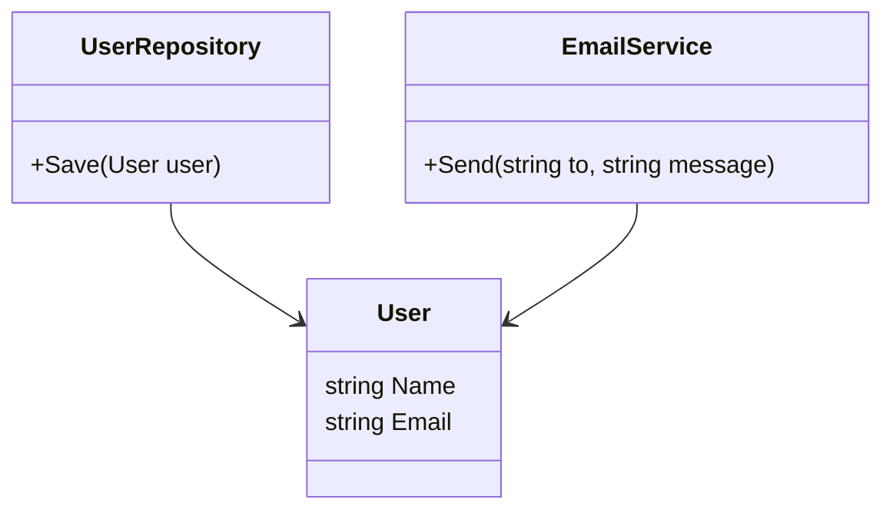

# Single Responsibility Principle (SRP) - Nguyên Lý Trách Nhiệm Duy Nhất

---

## 1. Khái Niệm

**Định nghĩa:**  
Single Responsibility Principle (SRP) phát biểu rằng:  
> "A class should have only one reason to change."  
> (Một class chỉ nên có **một** lý do để thay đổi.)

**Ý nghĩa:**
- Mỗi class chỉ đảm nhận **một trách nhiệm duy nhất**.
- Giảm ảnh hưởng dây chuyền khi thay đổi.
- Giúp code dễ bảo trì, dễ đọc, dễ test và dễ mở rộng.

---

## 2. Tầm Quan Trọng

| Lợi ích                | Mô tả                                                    |
|------------------------|----------------------------------------------------------|
| **Giảm độ phức tạp**   | Mỗi class nhỏ gọn, dễ hiểu                               |
| **Dễ bảo trì**         | Thay đổi một phần chức năng chỉ tác động tới một class   |
| **Tái sử dụng tốt hơn**| Class có thể tái sử dụng trong ngữ cảnh khác            |
| **Dễ test**            | Có thể test riêng từng phần mà không phụ thuộc vào phần khác |

---

## 3. Ví Dụ Vi Phạm SRP

```csharp
public class User
{
    public string Name { get; set; }
    public string Email { get; set; }

    // Quản lý thông tin người dùng
    public void UpdateProfile(string name, string email)
    {
        Name = name;
        Email = email;
    }

    // Lưu dữ liệu vào DB
    public void SaveToDatabase()
    {
        Console.WriteLine("Saving user to database...");
    }

    // Gửi email thông báo
    public void SendEmailNotification(string message)
    {
        Console.WriteLine($"Sending email to {Email}: {message}");
    }
}
```

> **Vấn đề:**  
> Class `User` vừa quản lý dữ liệu, vừa xử lý lưu trữ, vừa gửi email.  
> Có nhiều lý do để thay đổi: thay đổi DB, thay đổi email, thay đổi business logic.

---

## 4. Ví Dụ Tuân Thủ SRP

### 4.1. Code

```csharp
// Quản lý thông tin người dùng
public class User
{
    public string Name { get; set; }
    public string Email { get; set; }
}

// Chịu trách nhiệm lưu dữ liệu
public class UserRepository
{
    public void Save(User user)
    {
        Console.WriteLine("Saving user to database...");
    }
}

// Chịu trách nhiệm gửi email
public class EmailService
{
    public void Send(string to, string message)
    {
        Console.WriteLine($"Sending email to {to}: {message}");
    }
}
```

### 4.2. Cách sử dụng

```csharp
var user = new User { Name = "Minh", Email = "minh@example.com" };
var repo = new UserRepository();
var emailService = new EmailService();

repo.Save(user);
emailService.Send(user.Email, "Welcome to our service!");
```

> **Ưu điểm:**  
> - Mỗi class có một nhiệm vụ duy nhất.  
> - Thay đổi logic email không ảnh hưởng tới DB.  
> - Dễ mở rộng và test từng phần.

---

## 5. Minh Họa Sơ Đồ

### 5.1. Vi Phạm SRP

```
┌─────────────────────────┐
│          User           │
│ - Quản lý thông tin     │
│ - Lưu vào DB            │
│ - Gửi email             │
└─────────────────────────┘
```
Một class làm quá nhiều việc → thay đổi một chức năng có thể ảnh hưởng toàn bộ.

---

### 5.2. Tuân Thủ SRP

```
┌───────────────┐   ┌────────────────┐   ┌────────────────┐
│     User      │   │ UserRepository │   │  EmailService  │
│ Thông tin     │   │ Lưu trữ DB     │   │ Gửi email      │
└───────────────┘   └────────────────┘   └────────────────┘
```

---

### 5.3. Sơ Đồ UML với Mermaid



> Mỗi class chỉ đảm nhận một trách nhiệm, dễ thay đổi và bảo trì.

---

